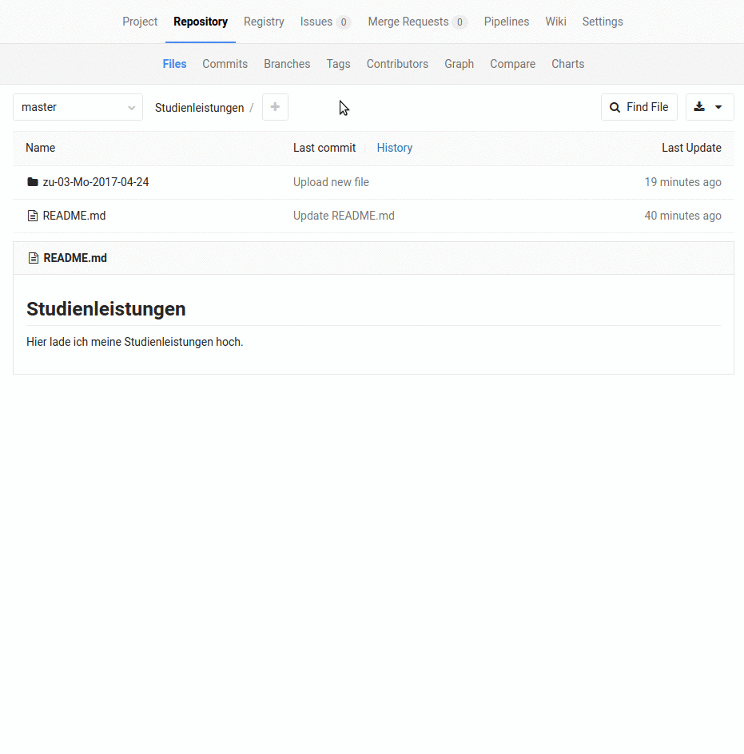

<!-- slide -->
# Static Site Generators für die Entwicklung von OER nutzen {.ignore}

**Axel Dürkop, Andreas Böttger, Tina Ladwig, ITBH an der TUHH**

---

<!-- slide -->
# Elevator Pitch {.ignore}

> "Wir haben an der TUHH ein technisches System entwickelt, mit dem wir OER erstellen, verarbeiten, vermischen und verbreiten können. Dafür nutzen wir GitLab und Static Site Generators."

---

<!-- slide -->
## Agenda {.ignore}

<!-- toc orderedList:0 depthFrom:1 depthTo:1 -->

* [Ziele des Workshops](#ziele-des-workshops)
* [Der Technikstack](#der-technikstack)
* [Der technische Ablauf](#der-technische-ablauf)
* [Soziale Workflows](#soziale-workflows)
* [Ausprobieren!](#ausprobieren)
* [Abschluss & Diskussion](#abschluss-diskussion)

<!-- tocstop -->

<!-- slide -->
# Ziele des Workshops

- Vorstellen eines 5R-gemäßen OER-Kreislaufs
- Aufzeigen
    - des Potenzials von **Git**
    - des großen Mehrwerts von **Markdown**
    - der Vorzüge von **Docker** für technische Lernsysteme, ehemals *E-Learning*

<!-- slide -->
# Der Technikstack

<!-- slide vertical: true -->
## Markdown

- Wileys 5R und ALMS-Framework
- Aus Markdown kann Vieles entstehen
    - mittels [pandoc](#)
    - mittels Static Site Generators

<!-- slide vertical: true -->
## Static Site Generator

- Definition: Programm, die aus Textdateien ein statisches HTML-Kontrukt erzeugt
- Beispiele:
    - Jekyll
    - GitBook
    - Hugo
    - Middleman
- Ausführen des Programms in der Regel auf der Kommandozeile

<!-- slide -->
## GitBook

- Static Site Generator der einfachen Art
- sowohl proprietärer Dienst (gitbook.com) als auch freie Software (Apache 2.0)
-

<!-- slide vertical: true -->
## GitLab

- freie Software (MIT-Lizenz) für das Selberhosten eines "GitHubs"
- (+) einfachere integrierte Workflows
- (+) volle Kontrolle über Daten und Konfiguration
- (-) Die Musik spielt immer noch auf GitHub
- (+/-) kein zentraler Ort

<!-- slide vertical: true -->
## Docker

- Vitualisierung von Diensten in Containern
- (+) schnelles Ausprobieren
- (+) Reproduzierbarkeit von Umgebungen
- (+) Skalierbarkeit
- (-) unausgereifte Administrationstools

<!-- slide -->
# Der technische Ablauf

- Autor_innen ergänzen/verändern Inhalte in **GitLab**.
- Dadurch zieht sich ein **GitLab-Runner** die aktuellen Markdown-Dateien aus GitLab
- Ein neuer **Docker-Container** wird gestartet, in dem alle Softwarekomponenten für die Generierung bspw. eines GitBooks enthalten sind.
- Das GitBook-**HTML-Konstrukt** sowie das GitBook-PDF werden erzeugt.
- Entstandene Artefakte werden auf einen **Webserver** geschoben.
- Der Vorgang dauert ca. 30 Sekunden und kann anschließend von vorne begonnen werden.

<!-- slide -->
# Soziale Workflows

- transparente Kollaboration durch *branches* und *WIP Merge Requests*
- Brainstorming und Vorbereitung der Gliederung im Wiki des Repos
- Entwicklungsversionen durch *Branches* (Review Apps)
- Qualitätssicherung durch *Merge Requests* und *Commit Comments*

<!-- slide vertical: true -->
## Beispiel: Commit Comments

<!-- slide -->
# Ausprobieren!

<!-- slide vertical: true -->
## Anmeldung in GitLab

Wir arbeiten mit vorbereiteten Nutzeraccounts in einem vorbereiteten Projekt.

- URL: https://collaborating.tuhh.de/
- Benutzername: ---
- Passwort: ---
- Projektname: `oercamp17-workshop`

<!-- slide -->
# Abschluss & Diskussion

<!-- slide vertical: true -->
## Fragen

- Wie können mit dem vorgestellten System die 5R von Wiley eingelöst werden?
